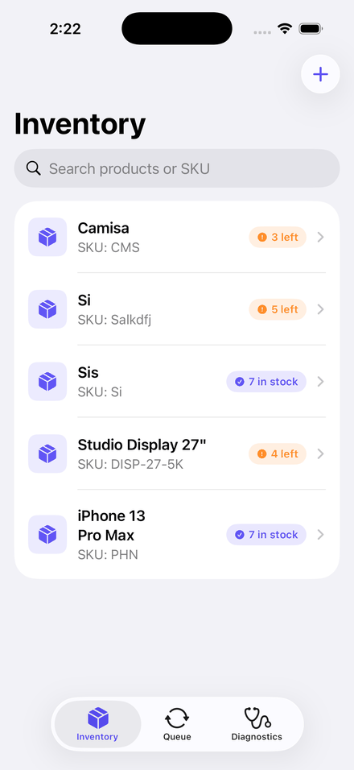
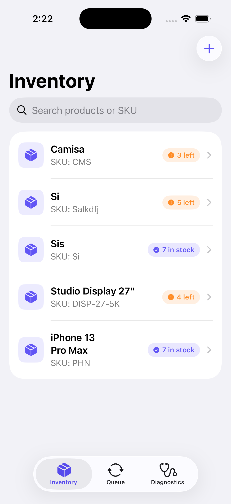
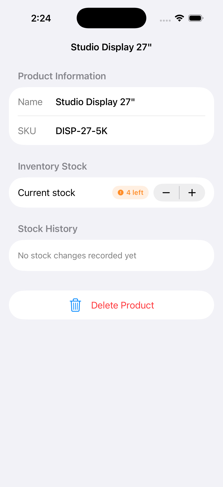
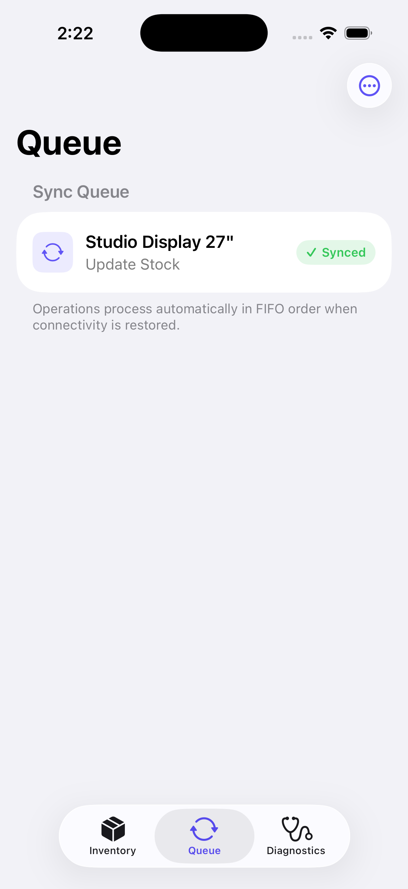
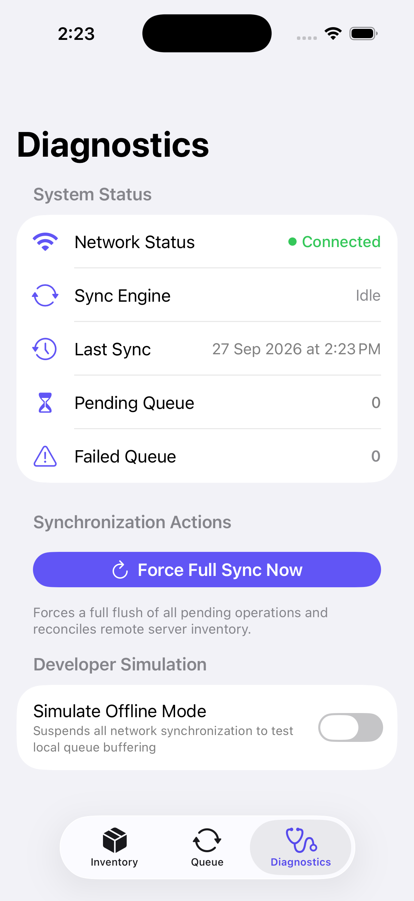

# Inventory iOS Client

Native iOS client engineered for offline-first inventory tracking, resilient network synchronization, and transactional persistence using SwiftUI, SwiftData, and the Network framework.



## Table of Contents

- Overview
- Architecture and Design Patterns
- Offline-First Synchronization Engine
- Data Model and Persistence
- UI and HIG Compliance
- Test Suite and Validation
- Prerequisites and Build Instructions
- Engineering Trade-offs

---

## Overview

Inventory is an iOS application designed for operational environments with intermittent or absent network connectivity (warehouses, logistics, retail stockrooms). It guarantees continuous user productivity by persisting all catalog modifications locally in SwiftData and orchestrating an ordered FIFO synchronization queue against the backend service.

---

## Architecture and Design Patterns

The client is structured according to Clean Architecture and Reactive State Management principles:

```
+-------------------------------------------------------------+
|                         SwiftUI Views                       |
|   - InventoryView        (Catalog, Search, Pull-to-Refresh) |
|   - InventoryDetails     (Stock Stepper, Audit History)     |
|   - InventoryFormView    (SKU Validation, Intake)           |
|   - PendingView          (FIFO Queue, Status, Errors)       |
|   - DiagnosticView       (Engine Controls, Offline Mode)    |
+-------------------------------------------------------------+
                              |
                              v
+-------------------------------------------------------------+
|                  SyncEngine (@MainActor)                    |
|   - FIFO Queue Coordinator                                  |
|   - Failure Retry Limiter (Max 3 retries)                   |
|   - Non-Destructive Remote Reconciler                       |
|   - Network State Observer Integration                      |
+-------------------------------------------------------------+
               |                               |
               v                               v
+-----------------------------+ +-----------------------------+
|    SwiftData Local Store    | |      ProductAPI Client      |
|  - SQLite Underlying Engine | |  - URLSession Async/Await   |
|  - Product Entity           | |  - Structured Error Parser  |
|  - PendingOperation Entity  | |  - DTO Serialization        |
|  - StockChange Entity       | |  - RESTful HTTP Transport   |
+-----------------------------+ +-----------------------------+
```

---

## Offline-First Synchronization Engine

### 1. FIFO Execution and Dependent Operations
When operating offline, operations are recorded with UTC timestamps (`createdAt`) and queued:
- Create (`.make`): Creates the product record on the server. Upon success, the generated `remoteId` is assigned to the local `Product` and propagated immediately to subsequent pending updates for that item.
- Update (`.updateStock`): If a product was created offline and updated before reconnection, the update operation pauses until the preceding `.make` operation completes and supplies the server identifier.
- Delete (`.delete`): If an item was created and deleted entirely while offline, the queue bypasses network requests and cleans up locally. If the item exists remotely, an atomic `DELETE` call is dispatched.

### 2. Synchronization Sequence

```
User Action (Offline)
     |
     v
SwiftData Insert: Product + PendingOperation (State: Pending)
     |
     v
[Network Restored / App Foreground]
     |
     v
SyncEngine.fullSync()
     |
     +---> 1. Process Queue (FIFO by createdAt)
     |        |
     |        +---> POST /products (Product Created, remoteId assigned)
     |        +---> PUT /products/{id} (Stock changes flushed)
     |        +---> Error Handling: If 4xx/5xx, capture error and increment tries
     |
     +---> 2. Reconcile Remote Catalog
              |
              +---> Fetch GET /products
              +---> Protect items with open local edits (no overwrite)
              +---> Detect and purge remote deletions
              +---> Sync authoritative stock change audit logs
```

### 3. Non-Destructive Conflict Prevention
A critical flaw in naive synchronization implementations is overwriting local uncommitted edits during remote fetches. The `SyncEngine` identifies all `remoteId`s currently queued in pending operations and exempts them from remote overrides during `reconcileRemote()`.

### 4. Structured Error Handling and Diagnostics
Server validation failures (such as HTTP 409 duplicate SKU or HTTP 400 invalid parameters) are parsed into descriptive `APIError` objects and persisted directly in `PendingOperation.errorMessage`. Users can inspect the exact cause of failure in the Queue tab and trigger manual retries.

---

## Data Model and Persistence

### Product
- `name: String`: Name of the catalog item.
- `sku: String`: Unique Stock Keeping Unit identifier.
- `stock: Int`: Current available inventory quantity.
- `remoteId: Int?`: Server database identifier (nil until synchronized).
- `stockChanges: [StockChange]`: Cascade-deleted collection of quantity changes.
- `pendingOperations: [PendingOperation]`: Inverse relationship cascading queue items.

### StockChange
- `date: Date`: Timestamp of the stock alteration.
- `delta: Int`: Relative change (+5 intake, -2 fulfillment).
- `source: String`: Contextual attribution (Initial Intake, Order #1042, Manual Edit).

### PendingOperation
- `type: OperationType`: make, updateStock, or delete.
- `remoteId: Int?`: Target server identifier.
- `productName: String`: Display identifier.
- `state: OperationState`: pending, inProgress, successful, or failed.
- `tries: Int`: Current retry count (threshold: 3).
- `createdAt: Date?`: Timestamp used for strict FIFO sorting.
- `errorMessage: String?`: Last captured server error description.

---

## UI and HIG Compliance

The user interface adheres to Apple Human Interface Guidelines:
- Inset Grouped lists with dynamic typography.
- Color-coded inventory badges (`Capsule`) for in-stock, low-stock warning, and out-of-stock states.
- Native steppers and swipe actions for queue manipulation and deletions.
- Dedicated Diagnostics panel providing real-time network connectivity indicators, queue volume metrics, and a Developer Offline Simulation toggle.

| Catalog Screen | Product Details & History |
| :---: | :---: |
|  |  |

| Sync Queue | Diagnostic Controls |
| :---: | :---: |
|  |  |

---

## Test Suite and Validation

The project includes an automated test suite verifying synchronization contracts, model state transitions, and DTO parsing.

Run the test suite directly from the command line:

```bash
./run_tests.sh
```

### Covered Test Cases
- `testPendingOperationInitialState`: Asserts initial state, zero retries, and nil error messaging upon creation.
- `testMaxRetriesExceededTransitionsToFailed`: Verifies threshold enforcement when retries reach `maxRetries`.
- `testFIFOOrderingByCreatedAt`: Validates that SwiftData fetch descriptors correctly sort queued operations chronologically.
- `testCascadeDeleteCleansUpPendingOperations`: Confirms that deleting a local product cascades and purges orphaned queue items.
- `testProductDTODecoding`: Tests ISO 8601 date decoding and nested stock change serialization.
- `testCreateProductRequestEncoding`: Ensures outbound JSON requests conform to backend contracts.
- `testAPIErrorLocalization`: Verifies error localization strings across all status code categories.

---

## Prerequisites and Build Instructions

### Requirements
- macOS 14.0 or later
- Xcode 16.0 or later
- iOS 17.0+ Simulator or physical device

### Building and Running
1. Open `Inventory.xcodeproj` in Xcode.
2. Select an iOS Simulator (e.g. iPhone 16 / iPhone 17).
3. Ensure `InventoryApi` backend service is running locally on port 5239, or configure the host in `Constants.swift`.
4. Press Cmd+R to build and launch the application.

---

## Engineering Trade-offs

1. Centralized SyncEngine vs Decentralized Model Execution:
   - Moving sync execution out of SwiftData model methods into an isolated `@MainActor` engine prevents data races, ensures sequential FIFO ordering, and avoids multithreaded context mutations.

2. In-Memory SwiftData Test Configurations:
   - The test suite utilizes `ModelConfiguration(isStoredInMemoryOnly: true)` to ensure total isolation between tests, zero disk I/O side-effects, and rapid execution speeds.

3. Transient Queue with Server Error Retention:
   - Instead of discarding failed operations silently, failed operations retain their error descriptions and retry counters. This provides clear diagnostic visibility without corrupting user data.
